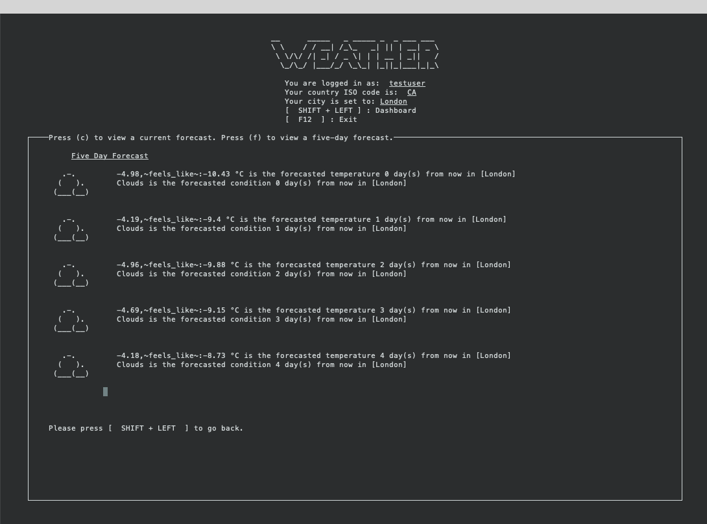

<!-- Main -->

<!-- One -->
<section id="one">
	

		<header class="major">
			<h2>Completed and In-Progress Projects</h2>
		</header>
		
The following collection of projects contains works both completed and in-progress. Where applicable, instructions for compiling and small videos showing the main features and interface have been included. These projects have been completed using various programming languages and contain both practical and academic applications.

	

</section>

<!-- Two -->
<section id="two" class="spotlights">
	<section>
		
		

			

				<header class="major">
					<h3>Raspberry Pi Dashboard</h3>
				</header>
				
A command-line based dashboard created for the Raspberry Pi that can retrieve news headlines, the current weather, and statutory holidays. It was built using C++ and ncurses for a unique text-based UI. It connects to various APIs and is meant to be a continually running on-screen information hub that can be customized for each user.
				 
				 
				<b>Languages, Technologies, and Tools: </b>C++, ncurses, Doxygen

				<ul class="actions">
					<li><a href="https://github.com/mitchmancuso/Pi-Dash" class="button">Learn More</a></li>
				</ul>
			

		

	</section>
	<section>
		
		

			

				<header class="major">
					<h3>CORBA File Sharing</h3>
				</header>
				
A P2P file sharing application built in Java using CORBA (Common Object Request Broker) and MySQL. This program allows users to share files over a network and act as both client and server when requesting or receiving file sharing requests. Files are stored and downloaded locally to a shared or non-shared folder at the user's discretion. Options also exist to unshare files (make it unavailable for downloading on the server) or sharing files previously marked as private.
                				 
                				 
                				<b>Languages, Technologies, and Tools: </b>Java, CORBA, SQL

				<ul class="actions">
					<li><a href="https://github.com/mitchmancuso/CORBA-Share" class="button">Learn more</a></li>
				</ul>
			

		

	</section>
	<section>
    		
    		

    			

    				<header class="major">
    					<h3>Lossless PGM Encoder and Decoder (LZ77)</h3>
    				</header>
    				
A program built in C that is able to accept PGM images and encode them using the Lempel-Ziv algorithm with a user selected window buffer size. This program is able to read PGM images and encode them into a .LZ file that contains match sequences that can then be decoded back to the original PGM image.
                    				 
                    				 
                    				<b>Languages, Technologies, and Tools: </b>C

    				<ul class="actions">
    					<li><a href="https://github.com/mitchmancuso/LZ77-PGM" class="button">Learn more</a></li>
    				</ul>
    			

    		

    	</section>
		<section>
    		
    		

    			

    				<header class="major">
    					<h3>London WayFind</h3>
    				</header>
    				
An iOS application created using xCode and Swift which is meant to serve as a re-design of the City of London's transit application. Currently, the London Transit Commission's bus schedule information is available on a first-party basis from their website. The goal of this application is to utilize a number of William Lidwell's Universal Principles of Design in order to turn the web application into a native one that provides a rich and accessible experience for users.
                    				 
                                     
                                    <b>Interactive Demo: </b><a href="https://www.figma.com/proto/M0qi0bQ77QFDwecUPa6u46/London-WayFind-Interactive-Prototype?node-id=14%3A218&scaling=scale-down">Figma Prototype</a>
                    				 
                    				<b>Languages, Technologies, and Tools: </b>Swift, Objective-C, Cocoapods, Figma, Adobe XD

    				<ul class="actions">
    					<li><a href="https://github.com/mitchmancuso/London-WayFind" class="button">Learn more</a></li>
    				</ul>
    			

    		

    	</section>
</section>
	<section>
    		
    		

    			

    				<header class="major">
    					<h3>Job Hunt Tracking System (Unnamed) (In-Progress)</h3>
    				</header>
    				
A kanban board style job tracking system that lets job seekers conveniently track their application progress with a high degree of clarity and organization. Job hunters can save interesting postings, set reminders, move their application along the screening process and more!
                    				 
                    				 
                    				<b>Languages, Technologies, and Tools: </b>MongoDB, Express, React, Node JS

                    				<!-- 
    				<ul class="actions">
    					<li><a href="https://github.com/mitchmancuso/LZ77-PGM" class="button">Learn more</a></li>
    				</ul>
    				-->
    			

    		

    	</section>

